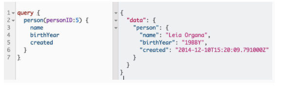
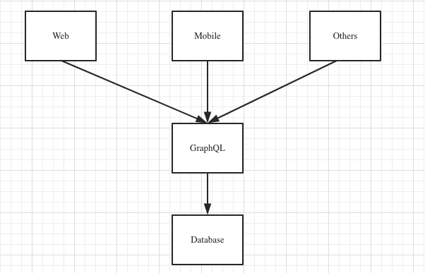
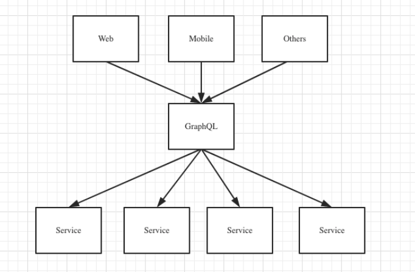
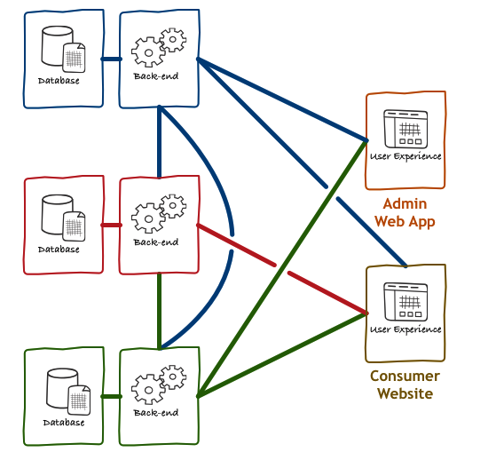
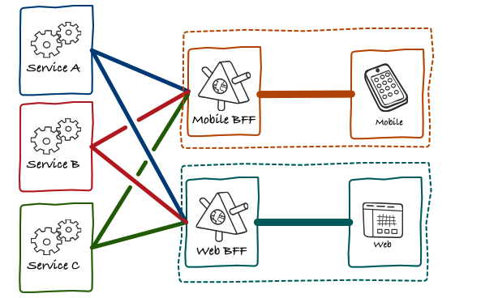

##GraphQL

###起源

2012 年，当时 Facebook 决定重新构建原生移动应用。起因是公司的 iOS 和 Android 应用停留在围绕移动网站视图进行简单包装的阶段。他们也有自己的 RESTful 服务器和 SQL 数据库，可惜性能不佳。正因如此，工程师们意识到需要改进将数据发送到客户端应用的方式。

2015 年 7 月，发布了最初的 GraphQL 规范以及基于 Javascript 的实现库 graphql.js。

2016 年 9 月，在 Facebook 内部使用了许多年后，GraphQL 脱离了“技术预览”阶段，这宣告 GraphQL 正式进入生产环境。

**定义**

GraphQL 是一门为 API 和运行时而生的查询语言。

Graph + Query Language = 图表化(可视化)查询语言

**特点**

1. 请求你所要的数据不多不少
2. 获取多个资源只用一个请求
3. 描述所有的可能类型系统
4. 快步前进强大的开发者工具 
5. API 演进无需划分版本
6. 使用你现有的数据和代码

###RESTful APIs vs GraphQL APIs:

RESTful APIs

**优点**

1. 适合开放性高的API
2. 行为和资源分离，更容易理解
3. 提出使用版本号（例如v1、v2），更加规范

**缺点**

1. 过量获取

接口返回的数据太多, 超过了客户端的需求

2. 获取不足

一次请求一般情况下只能获取单一资源并不能得到所有想要的资源

3. 接口缺乏灵活性

有时候客户端的需求发生了变化, 导致不得不创建新的接口

GraphQL APIs

**优点**

1. 所见即所得

接口返回的数据即是想要的数据

2. 减少网络请求次数 

一次网络请求即可获取资源以及其子资源

3. 代码即文档

GraphQL 会把 schema 定义和相关的注释生成可视化的文档，从而使得代码的变更，直接就反映到最新的文档上，避免 RESTful 中手工维护可能会造成代码、文档不一致的问题。

4. 参数类型强校验

RESTful 方案本身没有对参数的类型做规定，往往都需要自行实现参数的校验机制，以确保安全。但 GraphQL 提供了强类型的 schema 机制，从而天然确保了参数类型的合法性。

**缺点**

1. 缓存

用 Restful API 的时候，数据可以以 URL 为单位进行缓存，效率还是挺好的，而以点或者栏的颗粒度进行缓存，难度就大的多了。

2. 性能问题

仅仅需要一个大表中的一部分，特别是一小部分时，用 GraphQL 可能还是一个不错的选择， 但是如果需要的是全部信息，这条信息里面包含成百上千条数据，那么这种请求就会极其费时，性能问题就会很突出。

###GraphQL 生态圈

**服务端**

GraphQL 服务器可用任何可构建 Web 服务器的语言实现。除 JavaScript 之外， Ruby ， Python ， Scala ， Java ， Clojure ， Go ， .NET 等都有实现供参考

[ApolloServer](https://www.apollographql.com/docs/apollo-server/) 一个开源的、符合规范的GraphQL服务器

[DataLoader](https://github.com/graphql/dataloader) 对数据进行有效地缓存和批量化数据加载

**客户端**

[Apollo Client](https://www.apollographql.com/docs/react/) Javascript 应用的状态管理库

[Relay](https://facebook.github.io/relay/) Facebook 官方的 GraphQL 客户端，它大大优化了性能，但只能在 Web 上可用

**开发工具**

[GraphiQL](https://github.com/graphql/graphiql) 本质上可认为是个 GraphQL 客户端，但配有编辑、自动补全、文档浏览等功能，常用于服务端的调试

[GraphQL Playground](https://www.apollographql.com/docs/apollo-server/testing/graphql-playground/) 图形化，可交互的 GraphQL IDE

**最佳实践**

[GraphQL Best Practices](https://graphql.org/learn/best-practices/)

###应用方式

**一、直接接入方式**

**二、集成现有服务**

**BFF 架构**

随着互联网的蓬勃发展，越来越多的终端、业务、平台的出现， 将前后端的交互变得日益复杂。同一份数据可能以不同的形态和结构在不同的场景下使用。

与此同时随着微服务的应用越来越普及，对后端服务进行了更加细粒度的拆分， 从而达到解耦的目的。但是这样一来原本可以通过一个 API 请求即可获得的数据，需要进行多次请求才能够获得所有想要的数据。 甚至稍微有些 UI 层面的改动，可能就需要对有关接口进行修改或增加相应的接口，导致后端 API 越来越臃肿，逻辑也越来越重。

BFF 

Back-end for Front-end (以下简称 BFF ) 顾名思义，是为前端而存在的后端(服务)中间层。即传统的前后端分离应用中，前端应用直接调用后端服务，后端服务再根据相关的业务逻辑进行数据的增删查改等。那么引用了 BFF 之后，前端应用将直接和 BFF 通信，BFF 再和后端进行 API 通信，所以本质上来说，BFF 更像是一种“中间层”服务。

1. 没有BFF 的前后端架构

在传统的前后端设计中，通常是 App 或者 Web 端直接访问后端服务，后台微服务之间相互调用，然后返回最终的结果给前端消费。对于客户端（特别是移动端）来说，过多的 HTTP 请求是很昂贵的，所以开发过程中，为了尽量减少请求的次数，前端一般会倾向于把有关联的数据通过一个 API 获取。在微服务模式下，意味着有时为了迎合客户端的需求，服务器常会做一些与 UI 有关的逻辑处理。

2. 加入了 BFF 的前后端架构

加入了 BFF 的前后端架构中，最大的区别就是前端(Mobile, Web) 不再直接访问后端微服务，而是通过 BFF 层进行访问。并且每种客户端都会有一个BFF服务。从微服务的角度来看，有了 BFF 之后，微服务之间的相互调用更少了。这是因为一些UI的逻辑在 BFF 层进行了处理。

###总结

REST 在客户端是比较复杂页面的情况下显示出其局限性，GraphQL 可以作为其缺点的补充。

GraphQL 允许客户端在一次请求中准确声明视图所有所需的数据。与传统的 REST 方式相比，它的请求效率要更高，而且也避免了服务端 API 代码之间雷同的问题。

更重要的是，GraphQL 将服务端开发与客户端开发彻底解耦，客户端视图的变动完全不会影响到服务端的代码结构。

在微服务等场景下，GraphQL + BFF 的架构也不妨算是一个新的尝试。

###参考阅读

- [GraphQL 官网](https://graphql.org/)
- [Apollo 官网](https://www.apollographql.com/)
- [GraphQL – Netflix TechBlog](https://netflixtechblog.com/tagged/graphql)
- [微服务下使用GraphQL构建BFF](https://insights.thoughtworks.cn/use-graphql-build-bff-in-microservices/)
- [干货 | 万字长文全面解析GraphQL，携程微服务背景下的前后端数据交互方案](https://mp.weixin.qq.com/s/PovMmO6ddcpBO5A2WtY89Q)