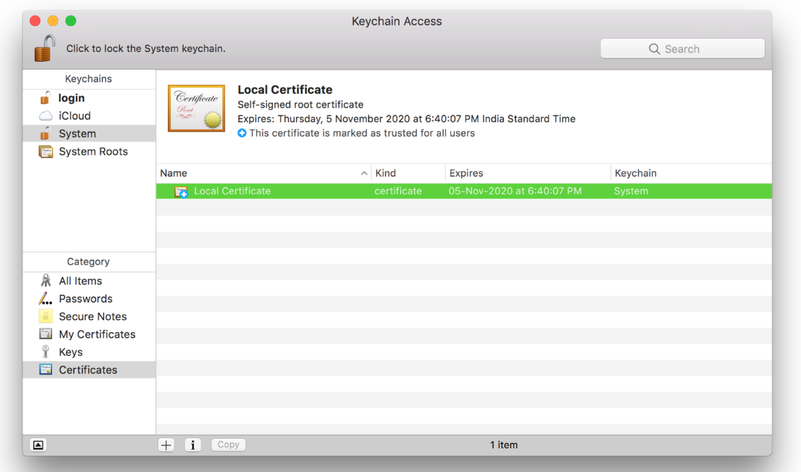

## HTML5 RECORD

### 音频格式
1. MP3格式
MP3 是利用 MPEG Audio Layer 3 的技术，将音乐以 1 : 10 甚至 1 : 12 的压缩率，压缩成容量较小的 file，换句话说，能够在音质丢失很小的情况下把文件压缩到更小的程度。而且还非常好的保持了原来的音质。正是因为 MP3 体积小，音质高的特点使得 MP3 格式几乎成为网上音乐的代名词。每分钟音乐的 MP3 格式只有 1MB 左右大小，这样每首歌的大小只有 3-4 兆字节。最高比特率 320K，没有高频部分是他的缺点，音质不高。

2. WMA 格式
WMA 是以减少数据流量但保持音质的方法来达到更高的压缩率目的，其压缩率一般可以达到 1 : 18，生成的文件大小只有相应 MP3 文件的一半。这对只装配 32M 的机型来说是相当重要的，支持了 WMA 和 RA 格式，意味着 32M 的空间在无形中扩大了 2 倍。此外，WMA 还可以通过 DRM 方案加入防止拷贝，或者加入限制播放时间和播放次数，甚至是播放机器的限制，可有力地防止盗版。128kbps 为 wma 最优压缩比，128kbps wma = 192kbps mp3

3. WAV 格式
WAV 格式是最早的数字音频格式，被 Windows 平台及其应用程序广泛支持。WAV 支持许多压缩算法，支持多种音频位数、采样频率和声道，采用 44.1kHz 的采样频率，16 位量化位数，因此 WAV 的音质与 CD 相差无几，但 WAV 格式对存储空间需求太大不便于交流和传播。无损，体积大。

4. AAC 格式
AAC 实际上是高级音频编码的缩写。AAC 是 MPEG-2 规范的一部分。AAC 所采用的运算法则与 MP3 的运算法则有所不同，AAC 通过结合其他的功能来提高编码效率。AAC 的音频算法在压缩能力上远远超过了以前的一些压缩算法（比如 MP3 等）。它还同时支持多达 48 个音轨、15 个低频音轨、更多种采样率和比特率、多种语言的兼容能力、更高的解码效率。总之，AAC 可以在比 MP3 文件缩小 30% 的前提下提供更好的音质。是目前最好的有损格式之一。有多种编码，faac，nero 为常见，比特率最高 448kbps。硬件支持方面，高级 mp3 和现在手机普遍支持。

5. Mp3Pro 格式
Mp3Pro 是 Mp3 编码格式的升级版本。MP3Pro 是由瑞典 Coding 科技公司开发的，在保持相同的音质下同样可以把声音文件的文件量压缩到原有 MP3 格式的一半大小。而且可以在基本不改变文件大小的情况下改善原先的 MP3 音乐音质。它能够在用较低的比特率压缩音频文件的情况下，最大程度地保持压缩前的音质。MP3pro 可以实现完全的兼容性。经过 mp3Pro 压缩的文件，扩展名仍旧是 .mp3。可以在老的 mp3 播放器上播放。老的 mp3 文件可以在新的 mp3pro 播放器上进行播放，相当于 mp3 压缩后的格式。

6. FLAC 格式
FLAC 即是无损音频压缩编码。FLAC 是一套著名的自由音频压缩编码，其特点是无损压缩。不同于其他有损压缩编码如 MP3 及 AAC，它不会破任何原有的音频资讯，所以可以还原音乐光盘音质。现在它已被很多软件及硬件音频产品所支持。简而言之，FLAC 与 MP3 相仿，但是是无损压缩的，也就是说音频以 FLAC 方式压缩不会丢失任何信息。这种压缩与 Zip 的方式类似，但是 FLAC 将给你更大的压缩比率，因为 FLAC 是专门针对音频的特点设计的压缩方式，并且你可以使用播放器播放FLAC 压缩的文件，就象通常播放你的 MP3 文件一样。
无损格式，较 ape 而言，他体积大点，但是兼容性好，编码速度快，播放器支持更广。

7. APE 格式
APE 是目前流行的数字音乐文件格式之一。与 MP3 这类有损压缩方式不同，APE 是一种无损压缩音频技术，也就是说当你将从音频 CD 上读取的音频数据文件压缩成 APE 格式后，你还可以再将 APE 格式的文件还原，而还原后的音频文件与压缩前的一模一样，没有任何损失。APE 的文件大小大概为 CD 的一半，但是随着宽带的普及，APE 格式受到了许多音乐爱好者的喜爱，特别是对于希望通过网络传输音频 CD 的朋友来说，APE 可以帮助他们节约大量的资源。
无损压缩格式，与 FLAC 相比，体积较小。编码速度偏慢。

8. MID 格式
MID 是 midi 的简称，是它的扩展名， “数字化乐器接口”，也就是说它的真正涵义是一个供不同设备进行信号传输的接口的名称。我们如今的 MIDI 音乐制作全都要靠这个接口，在这个接口之间传送的信息也就叫 MIDI 信息。 MIDI 最早是应用在电子合成器——用键盘演奏的电子乐器上， 由于早期的电子合成器的技术规范不统一，不同的合成器的链接很困难，在 1983 年 8 月，YAMAHA、ROLAND、KAWA I等著名的电子乐器制造厂商联合指定了统一的数字化乐器接口规范，这就是MIDI1.0 技术规范。此后，各种电子合成器以及电子琴等电子乐器都采用了这个统一的规范，这样，各种电子乐器就可以互相链接起来，传达 MIDI 信息，形成一个真正的合成音乐演奏系统。

9. OGG 格式
OGG 是一种新的音频压缩格式，类似于 MP3 等现有的音乐格式。但有一点不同的是，它是完全免费、开放和没有专利限制的。OGG Vobis 有一个很出众的特点，就是支持多声道，随着它的流行，以后用随身听来听 DTS 编码的多声道作品将不会是梦想。Ogg Vorbis 文件的扩展名是 .OGG。这种文件的设计格式是非常先进的。现在创建的 OGG 文件可以在未来的任何播放器上播放，因此，这种文件格式可以不断地进行大小和音质的改良，而不影响旧有的编码器或播放器。

10. WebM 格式
WebM 由 Google 提出，是一个开放、免费的媒体文件格式。WebM 影片格式其实是以 Matroska（即 MKV）容器格式为基础开发的新容器格式，里面包括了 VP8 影片轨和 Ogg Vorbis 音轨，其中 Google 将其拥有的 VP8 视频编码技术以类似 BSD 授权开源，Ogg Vorbis 本来就是开放格式。 WebM标准的网络视频更加偏向于开源并且是基于 HTML5 标准的，WebM 项目旨在为对每个人都开放的网络开发高质量、开放的视频格式，其重点是解决视频服务这一核心的网络用户体验。Google 说 WebM 的格式相当有效率，应该可以在 netbook、tablet、手持式装置等上面顺畅地使用。


### HTML5 录音

**使用 HTML5 的录音功能前提条件：**
1. 需要在 [https 或 file:/// 或  localhost](https://developer.mozilla.org/en-US/docs/Web/API/MediaDevices/getUserMedia#Privacy_and_security) 环境下 (https 非安全情况下也可进行录音)
2. 允许浏览器获取录音权限


**本地模拟 https 方式：**
1. nginx 启动 https
2. node 启动 https
3. charles 代理


**生成 SSL 证书**

1. 建立根 SSL 证书，在这个过程中需要输入密码短语，需要记住这个密码，后面会用到。 
```shell
openssl genrsa -des3 -out rootCA.key 2048
```
2. 使用生成的密钥创建新的根 SSL 证书。将它保存到一个名为 rootCA.pem 的文件。本证书有效期为 1024 天。
```shell
openssl req -x509 -new -nodes -key rootCA.key -sha256 -days 1024 -out rootCA.pem
```
```text
Country Name (2 letter code) []:CN
State or Province Name (full name) []:
Locality Name (eg, city) []:
Organization Name (eg, company) []:
Organizational Unit Name (eg, section) []:
Common Name (eg, fully qualified host name) []:Local Certificate
Email Address []:
```
3. 信任刚才生成的证书

  Mac 上双击刚才生成的 rootCA.pem 文件，然后选择“始终信任”。

  

4. 域 SSL 证书
  使用根 SSL 证书专门为位于 localhost 的本地开发环境颁发证书。
  创建一个新的 OpenSSL 配置文件 server.csr.cnf，以便在创建证书时导入这些设置，而不是在命令行中输入它们。
```shell
[req]
default_bits = 2048
prompt = no
default_md = sha256
distinguished_name = dn

[dn]
C=US
ST=RandomState
L=RandomCity
O=RandomOrganization
OU=RandomOrganizationUnit
emailAddress=hello@example.com
CN = localhost
```
5. 创建一个 v3.ext 文件以创建一个 X509 v3 证书。注意这里是如何指定 subjectAltName 的。

```shell
authorityKeyIdentifier=keyid,issuer
basicConstraints=CA:FALSE
keyUsage = digitalSignature, nonRepudiation, keyEncipherment, dataEncipherment
subjectAltName = @alt_names

[alt_names]
DNS.1 = localhost
```
使用 server.csr.cnf 中存储的配置设置为本地主机创建证书密钥。此密钥存储在 server.key 中。
```shell
openssl req -new -sha256 -nodes -out server.csr -newkey rsa:2048 -keyout server.key -config <( cat server.csr.cnf )
```
证书签名请求通过前面创建的根 SSL 证书发出，以便为 localhost 创建域证书。输出是一个名为 server.crt 的证书文件。
```shell
openssl x509 -req -in server.csr -CA rootCA.pem -CAkey rootCA.key -CAcreateserial -out server.crt -days 500 -sha256 -extfile v3.ext
```


**网址：https://localhost**


Mac 下 Nginx 启动 https

修改配置文件  /usr/local/etc/nginx/nginx.conf

```shell
server {
    listen       443 ssl;
    server_name  localhost;
    
    ssl_certificate      xxxx/server.crt; # xxxx 是文件路径
    ssl_certificate_key  xxxx/server.key; # xxxx 是文件路径
    
    location / {
        root   html;
        index  index.html index.htm;
    }
}
```
重启 nginx
```shell
nginx -s reload
```


Nodejs 启动 https

```javascript
const express = require('express')
const app = express()
const https = require('https')
const fs = require('fs')
const path = require('path')

const port = 443

app.use(express.static(path.join(__dirname, 'public'))); // 指定静态文件目录

app.get('/', (req, res) => {
  res.send('WORKING!')
})

const httpsOptions = {
  key: fs.readFileSync('xxxx/server.key'), // xxxx 是文件路径
  cert: fs.readFileSync('xxxx/server.crt') // xxxx 是文件路径
}

https.createServer(httpsOptions, app).listen(port, () => {
  console.log('server running at ' + port)
})

```


**Demo**

- [WebRTC-Experiment](https://www.webrtc-experiment.com/)
  - [RecordRTC](https://www.webrtc-experiment.com/RecordRTC/)
  - [MediaStreamRecorder](https://www.webrtc-experiment.com/msr/) 
- [Recorder](https://xiangyuecn.github.io/Recorder/)


### 参考

- [本地开发环境启动 HTTPS](https://medium.com/free-code-camp/how-to-get-https-working-on-your-local-development-environment-in-5-minutes-7af615770eec)
[本地开发环境启动 HTTPS（中文版本）](https://juejin.im/post/5cff091ee51d455cd73ba068)
-  [Recorder](https://github.com/xiangyuecn/Recorder)
-  [RecordRTC](https://github.com/muaz-khan/RecordRTC)
-   [MediaStreamRecorder](https://github.com/streamproc/MediaStreamRecorder)

